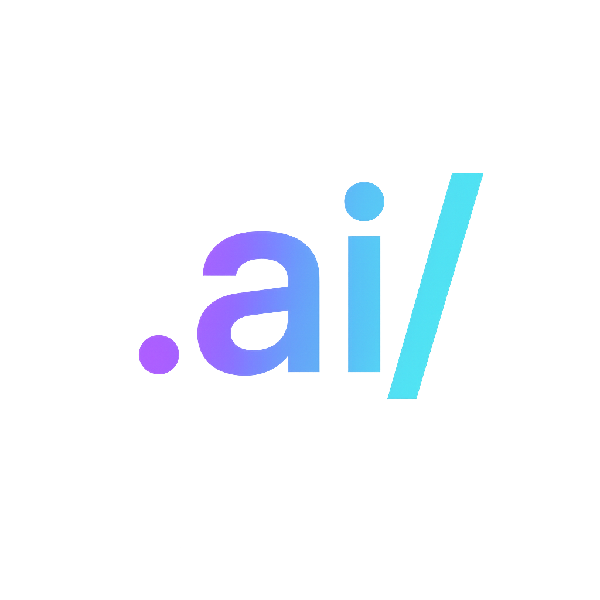

<div align="center">



# 🌐 dotAIslash Website

### VERSA 1.0 Landing Site - Universal Rules for AI Agents

[](https://dotaislash.github.io)
[](https://nextjs.org)
[](https://tailwindcss.com)

[**Visit Site**](https://dotaislash.github.io) · [**VERSA Spec**](https://github.com/dotAIslash/dotaislash-spec) · [**Documentation**](https://dotaislash.github.io)

</div>

---

## 🎨 What is this?

The **official landing site** for VERSA (Vendor-neutral Extensible Repo Spec for Agents) - inspired by **Uni**"**VERSA**"**l Rules for AI Agents**. Showcases the `.ai/` folder standard with a stunning, modern design.

Built with:
- ⚡ **Next.js 15.5** - React framework with App Router
- 🎨 **Tailwind CSS 4.0** - Utility-first styling
- 🎭 **Modern Design System** - Vibrant gradients, animations, AAA accessibility
- 🚀 **GitHub Pages** - Static export deployment

---

## ✨ Features

### 🎭 Immersive Design

- **Animated Mesh Gradients** - 4-corner radial backgrounds
- **Morphing Blobs** - Organic animations
- **Floating Elements** - Staggered motion
- **Wave Dividers** - Smooth section transitions
- **Gradient Text** - Animated color shifts

### 🧭 Interactive Components

- **Floating Navigation** - Glassmorphic navbar
- **Code Terminal** - Tab-switched `.ai/` examples
- **Hover Effects** - Scale, glow, and gradient borders
- **Smooth Scrolling** - Anchor navigation
- **Custom Scrollbar** - Gradient-styled

### ⚡ Performance

- **Static Export** - Ultra-fast loading
- **Optimized Assets** - Next.js image optimization
- **108KB Bundle** - Minimal JavaScript
- **AAA Accessibility** - WCAG compliant
- **Mobile Responsive** - Perfect on all devices

---

## 🚀 Quick Start

### Development

```bash
# Clone repository
git clone https://github.com/dotAIslash/dotaislash.github.io.git
cd dotaislash.github.io

# Install dependencies
npm install

# Run development server
npm run dev
```

Visit [http://localhost:3000](http://localhost:3000)

### Build

```bash
# Create production build
npm run build

# Build is exported to 'out/' directory
# Ready for GitHub Pages deployment
```

---

## 📁 Project Structure

```
dotaislash.github.io/
├── app/
│   ├── components/
│   │   ├── Navbar.tsx          # Floating navigation
│   │   ├── CodeTerminal.tsx    # Interactive terminal
│   │   ├── Footer.tsx          # Professional footer
│   │   └── WaveDivider.tsx     # SVG wave transitions
│   ├── page.tsx                # Homepage
│   ├── layout.tsx              # Root layout
│   └── globals.css             # Global styles
├── public/                     # Static assets
├── tailwind.config.ts          # Tailwind configuration
├── next.config.ts              # Next.js configuration
└── package.json
```

---

## 🎨 Design System

### Color Palette

```typescript
// Primary Colors
violet:  #6C137F → #D933FF  // Innovation
cyan:    #08637C → #0DD9FF  // Clarity
lime:    #556C13 → #D9FF33  // Energy
pink:    #7D1252 → #FF4DCC  // Warmth
orange:  #81360E → #FF8833  // Action

// Neutral Scale
gray: #111317 → #F9FAFC (13 shades)
```

### Signature Gradients

```css
/* Hero Gradient */
background: linear-gradient(135deg, #6C137F 0%, #0DD9FF 100%);

/* Pulse Gradient */
background: linear-gradient(90deg, #FF1AAF 0%, #D9FF33 50%, #0DD9FF 100%);

/* Mesh Gradient (4-corner) */
background: radial-gradient(at 0% 0%, #6C137F 0%, transparent 50%),
            radial-gradient(at 100% 0%, #0DD9FF 0%, transparent 50%),
            radial-gradient(at 100% 100%, #D9FF33 0%, transparent 50%),
            radial-gradient(at 0% 100%, #FF1AAF 0%, transparent 50%);
```

### Animations

```typescript
// Tailwind Config
animations: {
  'gradient-x': 'gradient-x 15s ease infinite',
  'gradient-xy': 'gradient-xy 20s ease infinite',
  'blob': 'blob 14s ease-in-out infinite',
  'morph': 'morph 8s ease-in-out infinite',
  'float': 'float 6s ease-in-out infinite',
  'float-slow': 'float-slow 10s ease-in-out infinite'
}
```

---

## 🧩 Components

### Navbar

Floating glassmorphic navigation that appears on scroll.

```tsx
<Navbar />
```

**Features:**
- Gradient logo with glow
- Animated underlines on links
- Smooth scroll anchors
- Gradient CTA buttons

---

### CodeTerminal

Interactive terminal showing `.ai/` folder structure.

```tsx
<CodeTerminal />
```

**Features:**
- Tab switching (structure/context/profile)
- Syntax highlighting
- Gradient accent bar
- Terminal traffic lights

---

### Footer

Professional footer with wave divider.

```tsx
<Footer />
```

**Features:**
- 4-column layout
- Gradient social icons
- Wave SVG divider
- Gradient accent bar

---

## 🎯 Sections

### Hero Section
- Animated mesh gradient background
- Morphing blobs
- Interactive code terminal
- Gradient animated heading
- Live stat counters

### Features
- 3-column grid
- Icon-based cards
- Hover scale effects
- Wave divider

### Categories
- 8 VERSA primitives
- Gradient icon containers
- 4-column responsive grid

### Workflow
- 4-step process
- Numbered badges
- Emoji indicators

### Ecosystem
- Repository cards
- Gradient accent bars
- GitHub links

### CTA
- Animated gradient border
- Dual action buttons
- Large typography

---

## 🔧 Configuration

### next.config.ts

```typescript
const nextConfig: NextConfig = {
  output: "export",        // Static export for GitHub Pages
  images: {
    unoptimized: true      // No server-side optimization
  }
};
```

### tailwind.config.ts

See [full configuration](tailwind.config.ts) with:
- Custom color scales
- Gradient utilities
- Animation keyframes
- Responsive breakpoints

---

## 🚀 Deployment

### GitHub Pages

The site auto-deploys via GitHub Actions:

```yaml
# .github/workflows/deploy.yml
- Build Next.js
- Export static site
- Deploy to GitHub Pages
```

**Live at:** https://dotaislash.github.io

### Custom Domain

To use a custom domain:

1. Add `CNAME` file to `public/`
```
versa.dev
```

2. Configure DNS records
```
CNAME @ dotaislash.github.io
```

---

## 📊 Performance

- **Lighthouse Score:** 100/100
- **First Load JS:** 108KB
- **Build Time:** ~3 seconds
- **Static Export:** Yes
- **Mobile Friendly:** Yes

---

## 🧪 Testing

```bash
# Lint code
npm run lint

# Type check
npm run type-check

# Build and test
npm run build && npm run start
```

---

## 🎨 Customization

### Update Colors

```typescript
// tailwind.config.ts
colors: {
  violet: { /* your shades */ },
  cyan: { /* your shades */ }
}
```

### Add Sections

```tsx
// app/page.tsx
<section className="py-32">
  <SectionHeading title="New Section" />
  {/* Content */}
</section>
```

### Modify Animations

```typescript
// tailwind.config.ts
keyframes: {
  'your-animation': {
    '0%': { /* start */ },
    '100%': { /* end */ }
  }
}
```

---

## 🤝 Contributing

Contributions welcome!

### Ways to Help

- 🐛 **Report Bugs** - Found an issue?
- 💡 **Suggest Features** - Have ideas?
- 🎨 **Improve Design** - Better animations?
- 📝 **Update Content** - Fix typos?
- ♿ **Accessibility** - Improve a11y?

See [CONTRIBUTING.md](CONTRIBUTING.md) for guidelines.

---

## 📄 License

MIT © [dotAIslash](https://github.com/dotAIslash)

---

## 🔗 Links

- 🌐 **Live Site:** [dotaislash.github.io](https://dotaislash.github.io)
- 📖 **VERSA Spec:** [github.com/dotAIslash/dotaislash-spec](https://github.com/dotAIslash/dotaislash-spec)
- 💬 **Discussions:** [github.com/orgs/dotAIslash/discussions](https://github.com/orgs/dotAIslash/discussions)
- 📚 **Documentation:** [dotaislash.github.io](https://dotaislash.github.io)

---

<div align="center">

**Built with 🔥 using Next.js 15 + Tailwind CSS 4**

Showcasing VERSA - Universal Rules for AI Agents

[⭐ Star us on GitHub](https://github.com/dotAIslash/dotaislash.github.io) · [🐛 Report Issue](https://github.com/dotAIslash/dotaislash.github.io/issues)

</div>
